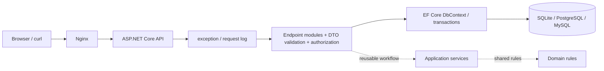

# 架构设计

采用模块化单体：先以单一部署单元保留清晰边界，交易链路稳定后再考虑拆分服务。

当前阶段采用按业务 URL 划分的垂直切片：Endpoint 负责 HTTP DTO、会话授权和用 EF Core 编排短事务，数据库 provider 与映射集中在 Infrastructure；Endpoint 不拼接 SQL，也不包含 provider 分支。Application 与 Domain 保持不依赖 ASP.NET Core/EF Core，供多个 URL 共享同一复杂流程或规则时抽取，避免为了层次本身制造只有一次调用的转发类。

每个已迁移 URL 放入对应 endpoint module，并有明确的 request/response DTO；跨模块复用或需要独立单元测试的业务流程再下沉 Application/Domain。每个 URL 的集中测试方案至少覆盖正常、参数错误、未认证/未授权（若适用）和资源不存在。
