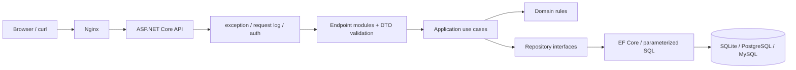

# 架构设计

采用模块化单体：先以单一部署单元保留清晰边界，交易链路稳定后再考虑拆分服务。

依赖只能向内：`Api -> Application -> Domain`，`Infrastructure -> Application + Domain`。Domain 不引用 ASP.NET Core、EF Core 或某个数据库 provider；API 的 endpoint 不写 SQL；Application 决定事务和授权编排。

每个已迁移 URL 新增一个 endpoint module、request/response DTO、use case、需要时的 repository 接口与 EF 实现，并至少有正常、参数错误、未认证/未授权（若适用）和资源不存在的测试。
